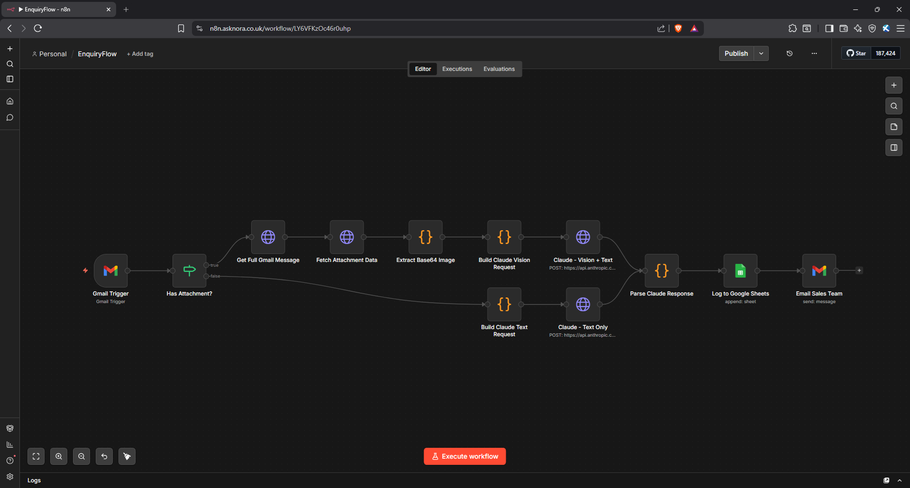
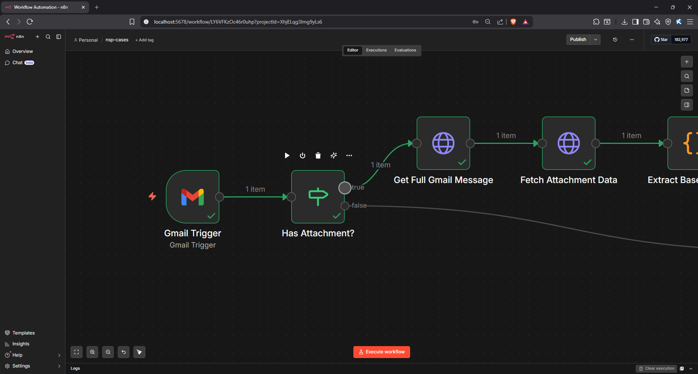
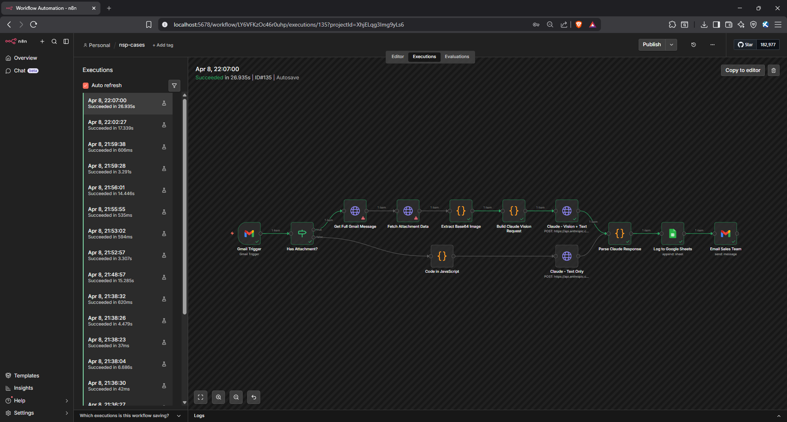
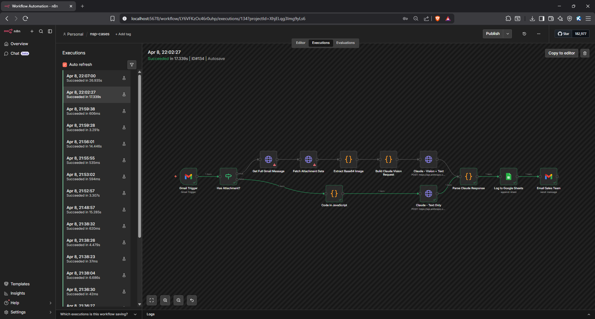
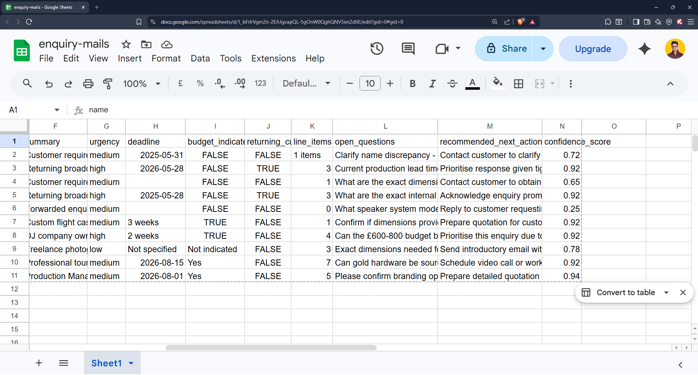
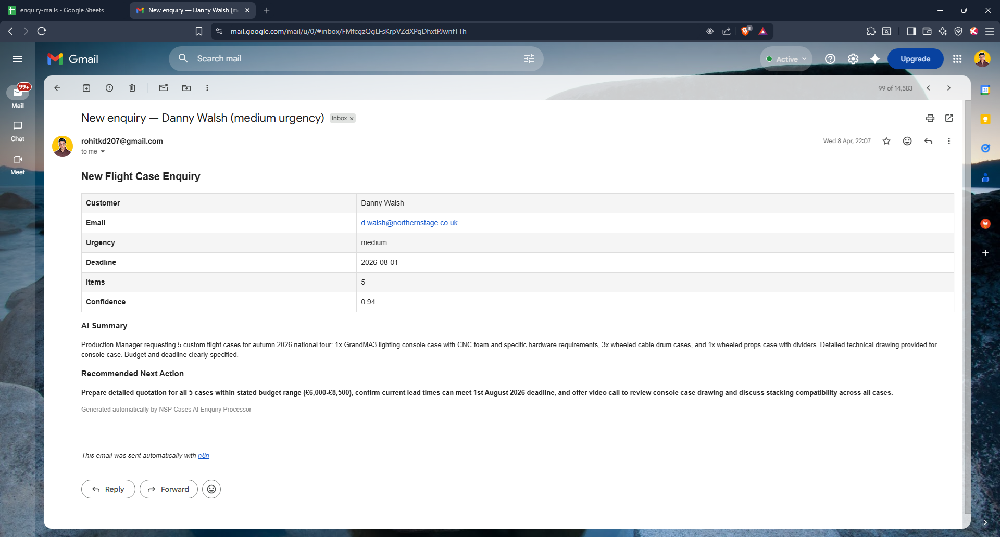

<div align="center">

<br />


<br />

[](./workflow/enquiryflow-workflow.json)
[](https://www.linkedin.com/in/rohitkumardubey)
[](https://n8n.io)
[](https://anthropic.com)

<br />

> **A fully automated AI workflow that watches a sales inbox, reads incoming enquiry emails and technical drawings, extracts structured data using Claude Vision, and delivers a ready-to-action brief to the sales team — in under 30 seconds. Zero manual data entry.**

<br />

</div>

---

## Table of Contents

- [Situation](#-situation)
- [Task](#-task)
- [How It Was Built](#-how-it-was-built)
- [Result](#-result)
- [Tech Stack](#-tech-stack)
- [Architecture](#-architecture)
- [Workflow Paths](#-workflow-paths)
- [Prompt Engineering](#-prompt-engineering)
- [Confidence Scoring](#-confidence-scoring)
- [Screenshots](#-screenshots)
- [Quick Start](#-quick-start)
- [Limitations](#-limitations)
- [Future Scope](#-future-scope)
- [Links](#-links)

---

## 🔍 Situation

Sales teams handling custom product enquiries face a daily bottleneck: every inbound email requires someone to manually read, extract dimensions, deadlines, budgets, and product requirements, then enter that data into a system before quoting can begin.

The problem compounds when technical drawings are attached. A team member now needs to open the file, interpret the dimensions, and manually cross-reference them with the email. This process is slow, inconsistent, and entirely unscalable as enquiry volume grows.

---

## 🎯 Task

Build a production-ready automated workflow that could:

- **Monitor** a sales inbox continuously, 24/7, without human intervention
- **Detect** whether an email contains a technical drawing attachment
- **Read and interpret** both the email text and the attached drawing using AI vision
- **Extract** fully structured data — customer details, line items, dimensions, deadlines, budgets — into a consistent JSON schema
- **Score** each extraction with a confidence rating so the sales team knows exactly how much to trust the output
- **Deliver** a formatted brief to the sales team in under 30 seconds from email receipt

---

## ⚙️ How It Was Built

The entire workflow was built in **n8n** (self-hosted via Docker), with **Claude API** handling all AI extraction across two intelligent paths that merge into a single output pipeline.

### System Flow

```
Incoming Email (Sales Inbox)
           │
           ▼
    [ Gmail Trigger ] ── polls every minute
           │
           ▼
   [ Has Attachment? ] ── checks MIME type
           │
    ┌──────┴──────┐
  TRUE          FALSE
    │              │
    ▼              ▼
[ Vision Path ] [ Text Path ]
Get Full Gmail  Build Claude
Message →       Text Request →
Fetch           Claude Text
Attachment →    Only
Extract
Base64 →
Build Claude
Vision Request →
Claude Vision
+ Text
    │              │
    └──────┬───────┘
           ▼
  [ Parse Claude Response ]
  strips markdown, parses JSON
           │
           ▼
  [ Log to Google Sheets ]
           │
           ▼
  [ Email Sales Team ]
  formatted HTML brief
```

### Key Engineering Decisions

- **Claude over rules-based parsing.** Customers write in natural language — different structures, abbreviations, implied context. Claude reads intent, not just keywords.
- **SVG attachments read as text, not images.** Claude reads SVG XML directly, making dimension labels and annotations fully accessible as text. More reliable and token-efficient than rasterising to PNG.
- **Intelligent routing reduces cost.** Not every email has a drawing. The IF node routes to the vision path only when needed, keeping token usage lean.
- **Code nodes for API requests.** n8n's expression engine breaks on special characters in email bodies. JavaScript template literals handle all edge cases correctly.
- **Confidence score as a safety valve.** In production, you do not want AI quietly passing incomplete data downstream. The score makes data quality visible and actionable before quoting begins.
- **Google Sheets as an ERP bridge.** Delivers immediate value with zero ERP integration work. Can be replaced with a direct webhook node without touching any other part of the workflow.

---

## 📊 Result

| Metric | Outcome |
|---|---|
| Time from email receipt to sales alert | Consistently under 30 seconds |
| Manual data entry required | Zero |
| Email types supported | Text only and text with attachments |
| Attachment formats supported | SVG, PNG, JPG, PDF technical drawings |
| Confidence scoring | 0.0 to 1.0 per enquiry |
| Test runs completed | 20+ across varied real-world scenarios |
| Confidence scores in testing | 0.92 (text only) and 0.93 (vision path) |
| ERP integration | Ready via webhook — no workflow changes needed |

The vision path consistently scored higher confidence than text-only extraction, as technical drawings provided explicit dimension data that removed ambiguity from the brief.

---

## 🛠 Tech Stack

<div align="center">

| Layer | Technology |
|---|---|
| Orchestration |  |
| AI Extraction |  (claude-opus-4-5) |
| Vision Processing |  |
| Email Integration |  |
| Infrastructure |  |
| Logging |  |
| Language |  |

</div>

---

## 🏗 Architecture

```
┌──────────────────────────────────────────────────────────┐
│                   Sales Inbox (Gmail)                    │
│              Polled every minute via trigger             │
└───────────────────────┬──────────────────────────────────┘
                        │
                        ▼
┌──────────────────────────────────────────────────────────┐
│              n8n (Self-hosted via Docker)                 │
│                                                          │
│   Gmail Trigger → Has Attachment? → Routing              │
│                                                          │
│   TEXT PATH                  VISION PATH                 │
│   Build Text Request         Get Full Gmail Message      │
│   Claude Text Only           Fetch Attachment Data       │
│                              Extract Base64 Image        │
│                              Build Vision Request        │
│                              Claude Vision + Text        │
│                                                          │
│              Parse Claude Response                       │
│              Log to Google Sheets                        │
│              Email Sales Team                            │
└──────────────────────────────────────────────────────────┘
                        │
                        ▼
┌──────────────────────────────────────────────────────────┐
│         Google Sheets (Structured Enquiry Log)           │
│         Sales Team Inbox (Formatted HTML Brief)          │
│         ERP/MRP System (via webhook — optional)          │
└──────────────────────────────────────────────────────────┘
```

---

## 🔀 Workflow Paths

### Path A — Text Only (FALSE branch)

Triggered when the email MIME type is `multipart/alternative` (no attachment). Claude receives the email text and extracts all structured fields directly.

### Path B — Vision + Text (TRUE branch)

Triggered when the MIME type is `multipart/mixed`. The workflow:

1. Fetches the full Gmail message via API
2. Downloads the attachment binary
3. Decodes base64 and fixes URL-safe encoding (`-` → `+`, `_` → `/`)
4. Converts SVG base64 to readable XML text
5. Sends email text and drawing content together to Claude Vision

Both paths merge at the **Parse Claude Response** node and share the same output pipeline.

---

## 🧠 Prompt Engineering

Five key decisions shaped the prompt design:

| Decision | Reason |
|---|---|
| Strict JSON schema enforcement | Prevents Claude from inventing its own format — downstream nodes depend on consistent field names |
| `null` for missing values | Makes data gaps explicit — never guesses dimensions that were not provided |
| Confidence score 0.0 to 1.0 | Enables intelligent triage — low scores flag incomplete enquiries for human review |
| `open_questions` array | Generates specific follow-up questions based on what is missing in that enquiry |
| `recommended_next_action` field | One clear sentence for the sales team — removes ambiguity about next steps |
| SVG read as text not image | Claude reads SVG XML directly — more reliable and token-efficient than rasterising |

The vision prompt is identical to the text prompt, with one additional instruction appended:

> *"A technical drawing is attached as SVG code — extract any dimensions, annotations, or requirements visible in it and include them in your analysis."*

---

## 🛡 Confidence Scoring

Every processed enquiry receives a confidence score that drives automatic status assignment:

```
Confidence Score    Status                  Sales Team Action
0.85 to 1.00   →   Ready to quote          Prepare quotation immediately
0.70 to 0.84   →   Review recommended      Check open questions before quoting
0.00 to 0.69   →   Needs information       Call customer before quoting
```

Scores below 0.70 trigger an alert flagging the enquiry as incomplete before it reaches the quoting stage.

---

## 📸 Screenshots

**n8n Workflow Canvas**



*The full workflow canvas showing both the vision path (top) and text-only path (bottom) merging into a shared output pipeline.*

**Attachment Routing Logic**



*The IF node routing based on MIME type — multipart/mixed triggers the vision path, multipart/alternative takes the text-only route.*

**Enquiry with Technical Drawing (Vision Path)**



*Claude Vision processing an email with an SVG technical drawing attached — dimensions, annotations, and requirements extracted directly from the file.*

**Enquiry without Attachment (Text Path)**



*Claude extracting structured data from a plain text enquiry email — customer details, line items, deadlines, and budget all parsed in under 30 seconds.*

**Google Sheets Enquiry Log**



*Every processed enquiry logged with full structured data — customer details, line items, dimensions, confidence score, and recommended next action.*

**Formatted Sales Team Email Alert**



*The HTML-formatted brief delivered to the sales inbox within 30 seconds of the enquiry arriving, ready to action without any manual data entry.*

---

## 🚀 Quick Start

### Prerequisites

- Docker installed and running
- Anthropic API key — [console.anthropic.com](https://console.anthropic.com)
- Google Cloud project with Gmail API and Google Sheets API enabled
- OAuth 2.0 credentials with `https://mail.google.com/` scope

### 1. Run n8n via Docker

```bash
docker run -it --rm \
  --name n8n \
  -p 5678:5678 \
  -v n8n_data:/home/node/.n8n \
  n8nio/n8n
```

### 2. Import the Workflow

1. Open n8n at `http://localhost:5678`
2. Click the three dots menu (top right) and select **Import**
3. Select `workflow/enquiryflow-workflow.json` from this repo
4. Add your credentials: Gmail OAuth2 and Anthropic API key
5. Update the Google Sheets document ID to your own sheet
6. Activate the workflow

### 3. Required Credentials

| Credential | Where to get it | Used in node |
|---|---|---|
| Anthropic API key | [console.anthropic.com](https://console.anthropic.com) | Claude Text Only, Claude Vision + Text |
| Gmail OAuth2 | Google Cloud Console | Gmail Trigger, Get Full Gmail Message, Email Sales Team |
| Google OAuth2 | Google Cloud Console | Fetch Attachment Data, Log to Google Sheets |

---

## ⚠️ Limitations

| Limitation | Detail |
|---|---|
| Attachment formats | SVG works most reliably. PNG and JPG depend on Claude Vision accuracy for dimension extraction. |
| Email polling interval | Currently set to every minute. Near real-time but not instant. |
| Multi-attachment emails | Only the first attachment is processed per email in the current version. |
| Language support | English only. Non-English enquiries will extract with reduced confidence. |
| Context length | Very long emails with extensive product lists may approach token limits. |

---

## 🚀 Future Scope

- **ERP/MRP direct integration** via HTTP Request node posting structured JSON on enquiry receipt
- **Multi-attachment support** to process several drawings from a single email
- **Voice enquiry channel** via Twilio — transcribe and process phone enquiries through the same pipeline
- **Automated quote generation** using extracted line items and a pricing rules engine
- **Slack or Teams alert** as an alternative to email notification for the sales team
- **Multi-language support** for international enquiries

---

## 🔗 Links

| Resource | URL |
|---|---|
| Workflow JSON | [Download and import](./workflow/enquiryflow-workflow.json) |
| Claude API | [anthropic.com](https://anthropic.com) |
| n8n Documentation | [docs.n8n.io](https://docs.n8n.io) |
| Gmail API | [developers.google.com/gmail](https://developers.google.com/gmail/api) |
| Built by | [Rohit Kumar Dubey](https://www.linkedin.com/in/rohitkumardubey) |

---

<div align="center">


*Built by [Rohit Kumar Dubey](https://www.linkedin.com/in/rohitkumardubey) · Feedback and contributions welcome*

</div>
